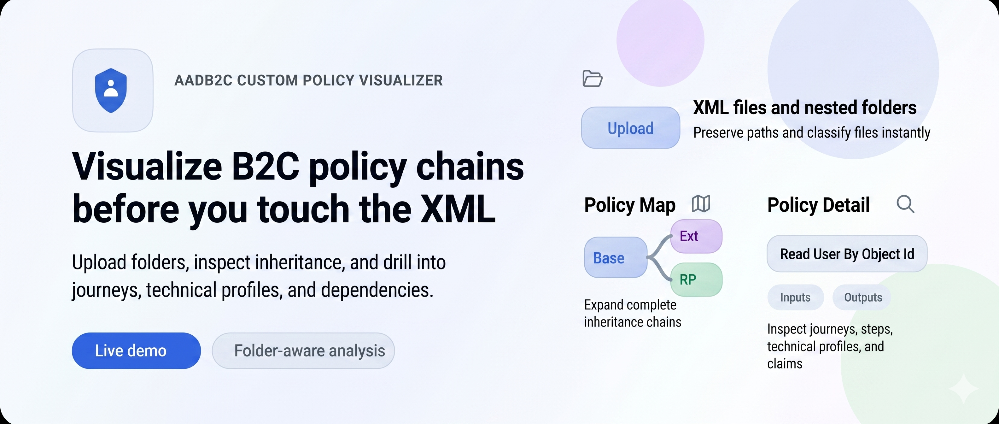
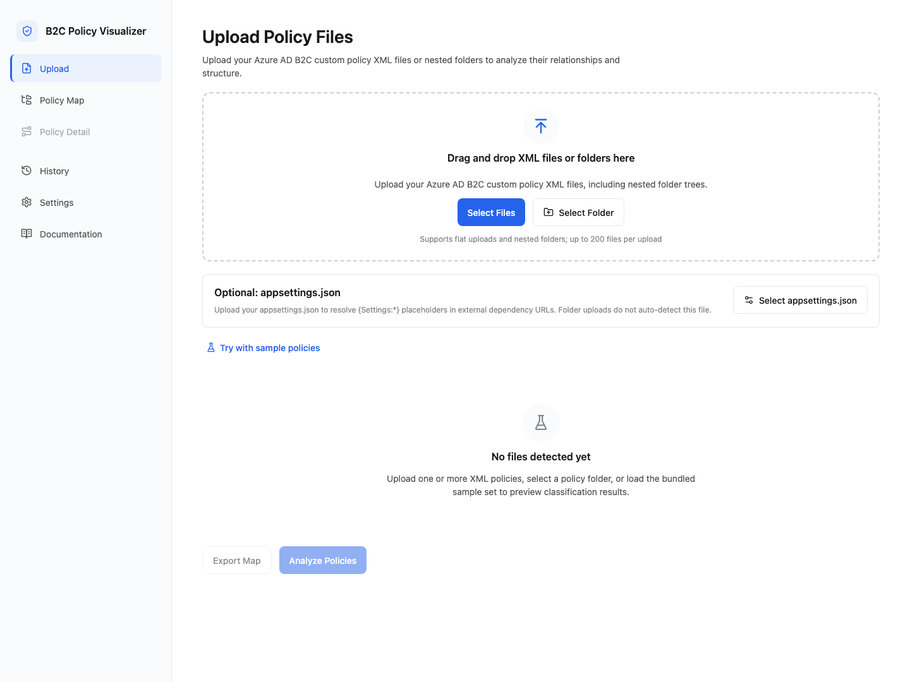
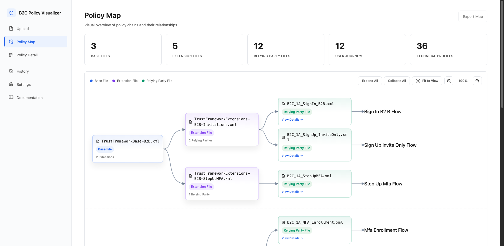
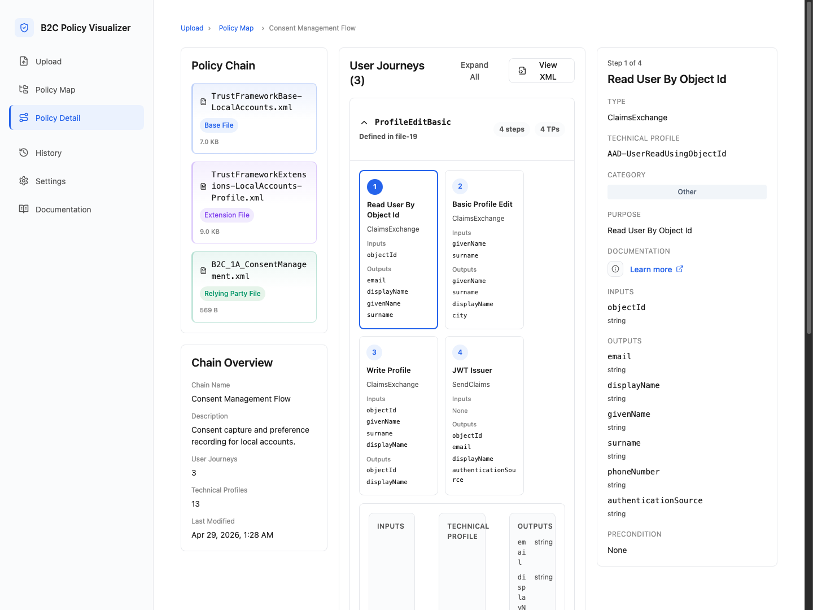

# AADB2C Custom Policy Visualizer

Visualize Azure AD B2C custom policy files as inheritance chains, journeys, and technical profile relationships without modifying the XML.

[Live demo](https://b2cpolicyanalyzer.orangemushroom-889f8aac.centralindia.azurecontainerapps.io/) • [Contributing](./CONTRIBUTING.md) • [License](./LICENSE)

## Why this exists

Azure AD B2C custom policies become hard to reason about quickly:

- `BasePolicy` inheritance spans multiple files
- relying party flows often hide behavior behind technical profiles and claims exchanges
- documentation is usually incomplete or stale
- migration and cleanup work starts with understanding what is already in production

This project gives you a read-only workspace for exploring those policy relationships visually.

## What it does

- Upload flat file sets or nested policy folders
- Classify files as Base, Extension, Relying Party, Localization, or Error
- Resolve inheritance chains to arbitrary depth
- Group related files into policy chains
- Surface malformed XML, missing references, cyclic inheritance, and schema warnings without aborting the whole analysis
- Render a policy map for chain-level inspection
- Drill into user journeys, orchestration steps, technical profiles, claims, and data flow
- Detect external dependencies such as REST APIs, HTML content definitions, and metadata endpoints
- Optionally resolve `{Settings:*}` placeholders in dependency URLs from an uploaded `appsettings.json`

## Product Tour

The screenshots below reflect the current public codebase.

| Upload and classify | Expanded policy map |
| --- | --- |
|  |  |



## Live demo

Hosted version:

- https://b2cpolicyanalyzer.orangemushroom-889f8aac.centralindia.azurecontainerapps.io/

Use the bundled sample flow in the app if you want to see the policy map and policy detail views without uploading your own files first.

## Core behavior

- Uploaded files are analyzed in memory and are not modified
- The application is read-only; it does not rewrite or generate policy XML
- Folder uploads preserve relative paths so duplicate filenames from different subfolders stay distinguishable
- `appsettings.json` remains optional and is only used to resolve placeholder values for external dependency URLs

## Who this is for

- Identity engineers working with Azure AD B2C custom policies
- Consultants assessing existing policy sets before modernization or migration work
- Teams documenting an inherited Identity Experience Framework implementation
- Developers who need a fast visual pass before deeper refactoring

## Tech stack

- React + Vite frontend
- Fastify backend
- TypeScript across the monorepo
- Shared analysis contracts in `packages/shared`

## Repository layout

```text
.
├── assets/
│   └── readme/        # screenshots used by this README
├── packages/
│   ├── backend/       # Fastify API and XML analysis engine
│   ├── frontend/      # React application
│   └── shared/        # shared TypeScript contracts
├── Dockerfile
├── package.json
└── tsconfig.base.json
```

## Local setup

### Prerequisites

- Node.js 20+
- npm 10+

### Install dependencies

```bash
npm install
```

### Run locally

Start the backend in one terminal:

```bash
npm run dev:backend
```

Start the frontend in another:

```bash
npm run dev:frontend
```

Then open:

```text
http://localhost:5173
```

## Build and test

Build the full workspace:

```bash
npm run build
```

Run the complete test suite:

```bash
npm test
```

Run package-level tests when working in one area:

```bash
npm test --workspace=packages/backend
npm test --workspace=packages/frontend
```

## Sample data

Bundled sample XML files live under `packages/backend/samples/` and are used by the in-app sample experience. They are intended for local exploration, UI verification, and demo flows.

## Current limitations

- Desktop-first experience; the app expects a viewport at 1280 px or wider
- No policy editing, XML generation, or write-back workflow
- No saved sessions or multi-user collaboration
- Some secondary navigation areas are present as MVP placeholders
- No public CI or deployment automation is included in this repository yet

## Roadmap

- Public deployment guidance and CI
- Export/report workflows
- Richer semantic documentation for technical profiles and journey steps
- Additional migration-oriented insights for Azure AD B2C to Microsoft Entra External ID scenarios

## Contributing

Contributions are welcome. Start with [CONTRIBUTING.md](./CONTRIBUTING.md) for setup, verification commands, and workflow expectations.

## License

This project is licensed under the MIT License. See [LICENSE](./LICENSE).
